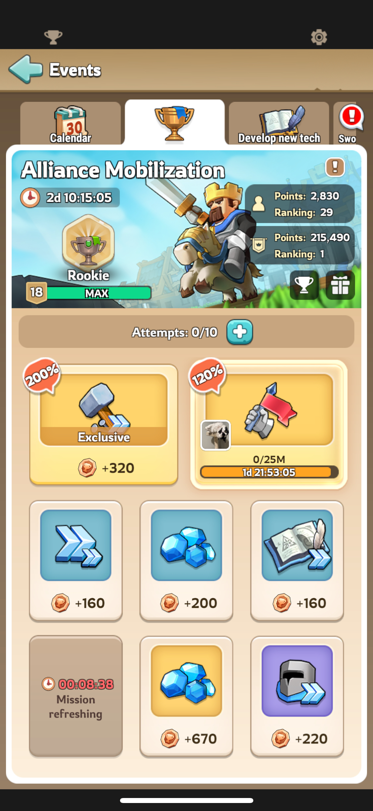

- [Snapshot](#snapshot)
- [Tier Rankings](#tier-rankings)
  - [Promotion](#promotion)
  - [Demotion](#demotion)
- [Rewards](#rewards)
  - [Alliance Monuments](#alliance-monuments)
- [General Things to be aware of](#general-things-to-be-aware-of)
- [Tasks In order of recommended priority (especially for F2P players...)](#tasks-in-order-of-recommended-priority-especially-for-f2p-players)
  - [Gather Resources](#gather-resources)
    - [Levels](#levels)
  - [General Rules](#general-rules)
  - [Strategies](#strategies)
  - [Prior to Task Selection](#prior-to-task-selection)
- [Resources](#resources)

# Snapshot
- Who
  - Every Alliance with > 15 members
  - Governors within that alliance with a Town Center (TC) level > 10 
- What
  - The point of the event is to perform tasks to earn points for your alliance in order to compete with other alliances
- Why
-- Completing tasks earns points for the entire alliance and allows us the chance to be promoted to the next rank
- When
  - Every 2 weeks
  - Starts on a Monday (00:00) and ends on a Saturday (24:00) (6 days)
- How
  - Tasks can be accepted via the events page

  - Tasks fall into 2 categories,
    - Exclusive Tasks: Available only to you. They're the top 2 tasks you see on the page. These tasks can be refreshed by you as many times as you like.
    - Alliance Tasks: Available to everyone in the alliance. Can only be refreshed by R4 and above. 
  - Only 1 task can be accecpted at any time

# Tier Rankings
- Alliances are ranked from lowest to highest based on the below:
  - Rookie (All Alliances start here)
  - Junior
  - Senior
  - Elite
  - Legendary
## Promotion
- Alliances that reach their level 8 milestone and  
## Demotion

# Rewards
## Alliance Monuments
- Accessible via clicking on giftbox on the event page
- Points are accumlated as the alliance completes tasks and each tier provides rewards

# General Things to be aware of
- Switching Alliances will forfeit one's right to participate if done in the middle of the event

# Tasks In order of recommended priority (especially for F2P players...)
## Gather Resources 
| Gather Resources | Base Value | 120% | 200% |
| ---------------- | ---------- | ---- | ---- |
| 10 Million       | 120        |      |      |
| 15 Million       | 150        |      |      |
| 20 Million       | 180        |      |      |
| 25 Million       | 210        |      |      |
| 30 Million       | 240        |      |      |
### Levels

## General Rules
- Resources (RSS) Points are weighted based on ease of gathering and are not 1 to 1. 
  - 1 Unit of Bread AND Wood are worth 1 point  
  - 1 unit of Stone is worth 5 points
  - 1 unit of Iron is worth 20 points
## Strategies
- Expectation here is simply to send your heroes out and gather resources. 
- Prioritize heroes based on what resource is being gathered
-- Olive = Bread
-- Edwin = Stone
-- Seth = Iron
-- Forrest = Wood
- You can pregame the event by sending out and gathering resources prior to the event starting and ensuring your gathers are timed to return after the event has started and the task has been accepted. This does require the task appearing, so recommendation is to allow for at least 1 or 2 hours of time refreshing and hunting for the resource gathering task. 
## Prior to Task Selection
- Ensure that you understand how many resource nodes you need to hit in order to hit your selected requirement. 

# Resources
- [Wiki link for event](https://kingshot.fandom.com/wiki/Alliance_Mobilization)