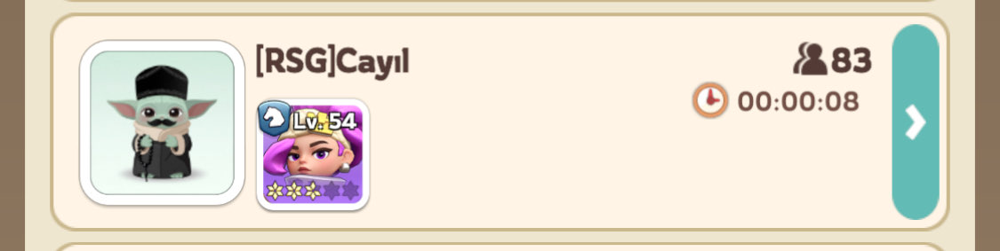
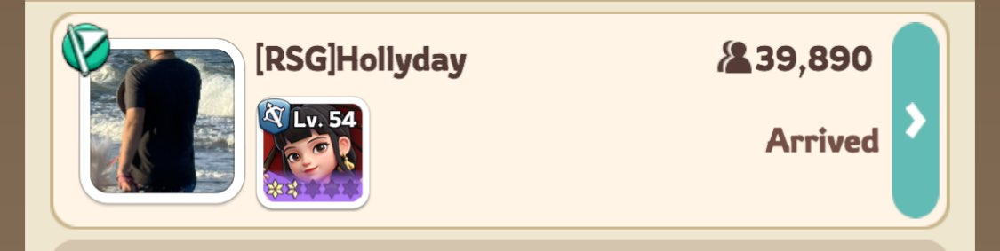
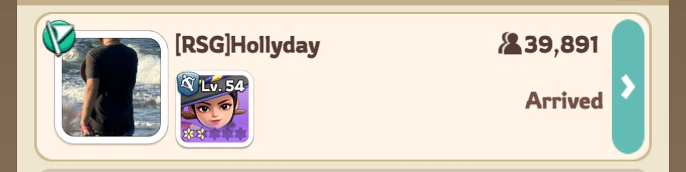
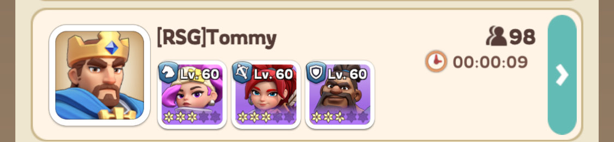
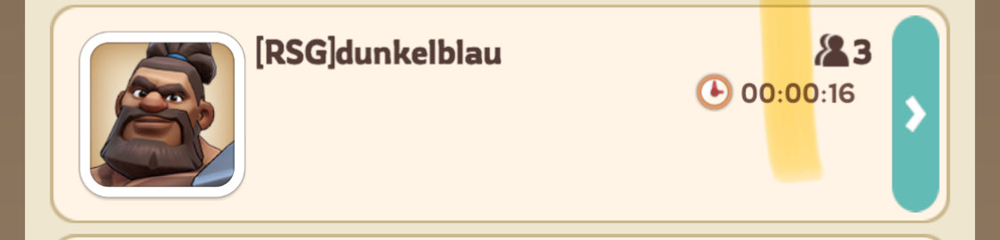
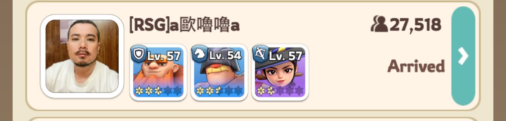
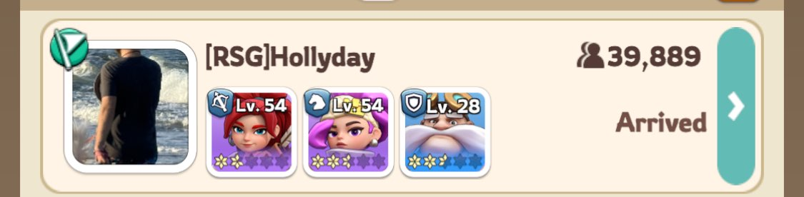

- [General Tips](#general-tips)
- [Leading a Rally](#leading-a-rally)
- [Joining a Rally](#joining-a-rally)
  - [Allowable Squad Combinations for Rally Joiners](#allowable-squad-combinations-for-rally-joiners)
    - [Amadeus Only](#amadeus-only)
    - [Chenko Only](#chenko-only)
    - [Amane Only](#amane-only)
    - [Yeonwoo Only](#yeonwoo-only)
    - [Any of the above + 2 others](#any-of-the-above--2-others)
    - [Troops Only](#troops-only)
  - [Not Allowed Squad Combinations for Rally Joiners](#not-allowed-squad-combinations-for-rally-joiners)
  - [Any Blue Hero as Joiner](#any-blue-hero-as-joiner)
  - [Diana as Joiner](#diana-as-joiner)
- [Powergaming Bear](#powergaming-bear)
- [Sources for further reading:](#sources-for-further-reading)

# General Tips
- There are 2 different trap times that are scheduled via R4/R5. 
  - You can only participate in 1 trap so choose the one that fits your schedule best. 
- Lethality is the most important stat for Bear Hunt
- The bear itself doesn’t inflict damage; the event is entirely focused on maximizing how much damage players can deal to it.
- To maximize damage, only specific heroes should be chosen when joining a rally—most importantly the Joiner Hero. 
  - This is the hero placed in the first slot of each squad. A rally can gain up to four additional skills from joiners, with each member contributing one. 
  - If more than four joiners are present, only the heroes with the highest level expedition skills will be counted.
    - For this reason, it’s crucial to choose the right heroes when joining a rally and avoid unintentionally replacing a lethality or attack‑boosting skill with another ability, such as boosting defense 
# Leading a Rally
- 3 Best Heroes, prioritizing heroes with lethality or attack boosting expedition skills

# Joining a Rally
## Allowable Squad Combinations for Rally Joiners
### Amadeus Only
### Chenko Only

### Amane Only

### Yeonwoo Only

### Any of the above + 2 others

> [!IMPORTANT] 
> You can select anyone you like as #2 and #3 heroes
### Troops Only

## Not Allowed Squad Combinations for Rally Joiners 
> [!WARNING] 
> Use of any of these will get you kicked from the rally.

> [!CAUTION] 
> These joiner heroes are disallowed due to the fact they typically have higher level skills than other heroes, which can unintentionally replace a lethality or attack boosting skill and result in significantly reduced damage.
## Any Blue Hero as Joiner

## Diana as Joiner

# Powergaming Bear
- The single best rally combination for bear is, 
  - Rally Leader
    - Amadeus
  - Rally Joiner 
    - Chenko
    - Chenko
    - Amane
    - Amane

# Sources for further reading:
- [Bear Hunt Expert Guide](https://kingshotguides.com/guide/bear-hunt-expert-guide/)
- [Kingshot Simulator for playing around with different combinations](https://kingshotsimulator.com/)

